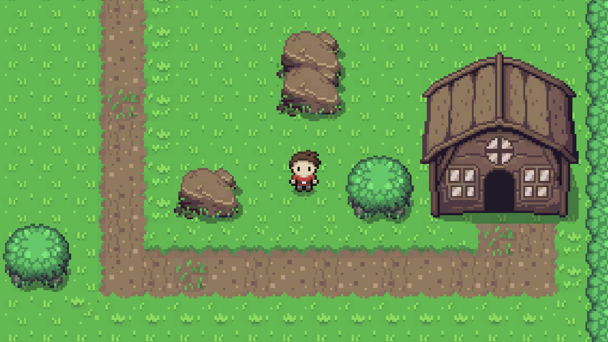

# Learning Unity RPG

Following a [tutorial](https://www.youtube.com/playlist?list=PL4vbr3u7UKWp0iM1WIfRjCDTI03u43Zfu) from [Mister Taft Creates](https://www.youtube.com/channel/UCZczqDvepgNqy80gTMGnUXw)

Graphics are from the [Zelda-like tilesets and sprites](https://opengameart.org/content/zelda-like-tilesets-and-sprites) graphics pack from [ArMM1998](https://opengameart.org/users/armm1998)

In game font is [Manaspace](https://www.1001fonts.com/manaspace-font.html#license) from [codeman38](http://zone38.net/).